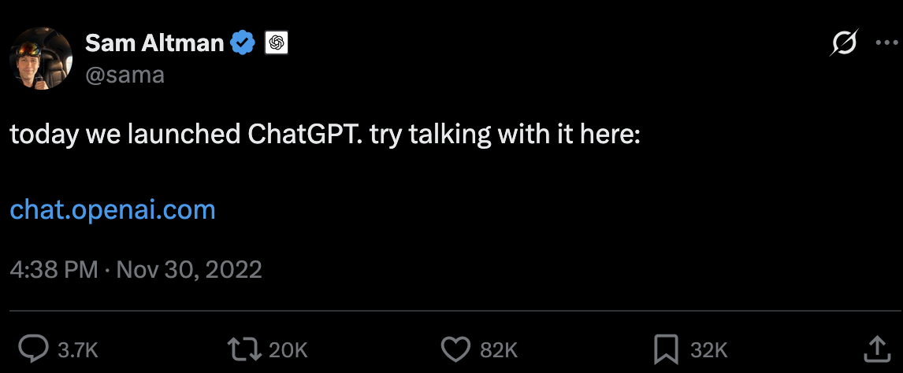

Em novembro de 2022, o mundo parou para conversar com uma caixa de texto. O lançamento do ChatGPT inaugurou uma fase de fascínio coletivo: máquinas redigiam textos, resumiam documentos e respondiam a perguntas complexas em segundos. 

{fig-align="center" width="85%"}

Quatro anos depois, em 2026, a pergunta que move a indústria de tecnologia mudou de patamar. Não buscamos mais apenas sistemas que respondam com coerência gramatical. O foco agora é construir sistemas que **executem tarefas no mundo real**.

Estamos atravessando a transição definitiva dos modelos conversacionais para os **Agentes Inteligentes (AI Agents)**: entidades de software projetadas para raciocinar, planejar, tomar decisões e operar ferramentas de forma autônoma para alcançar objetivos predefinidos.

---

## A Trajetória: Chatbot, Assistente e Agente

Para contextualizar o momento atual, vale analisar a evolução da IA generativa em três fases distintas:

| Nível | Dinâmica | Capacidade Central | Comportamento no Mundo Real |
| :--- | :--- | :--- | :--- |
| **1. Chatbot** *(~2023)* | **Reativa** *(Prompt $\rightarrow$ Resposta)* | Geração probabilística de texto | Responde a perguntas diretas, redige textos e resume conteúdos sem interagir com sistemas externos. |
| **2. AI Assistant** *(2024–2025)* | **Assistiva** *(Apoio ao fluxo de trabalho)* | Recuperação de contexto (RAG) e plugins | Sugere ações e complementações dentro do ambiente do usuário, consultando bases de dados sob demanda. |
| **3. AI Agent** *(2026)* | **Autônoma** *(Orientada a objetivos)* | Planejamento em etapas, uso de ferramentas e memória | Recebe uma meta complexa, decompõe em subtarefas, opera APIs/terminais e entrega o resultado validado. |

A mudança essencial introduzida pelos agentes é a capacidade de operar em loops cognitivos contínuos: **Percepção $\rightarrow$ Planejamento $\rightarrow$ Execução de Ferramentas $\rightarrow$ Avaliação de Resultados**.

```{mermaid}
graph LR
    A[Objetivo do Usuário] --> B[Agente Inteligente]
    B --> C{Planejamento & Raciocínio}
    C --> D[Execução de Ferramentas / APIs]
    D --> E[Avaliação do Resultado & Memória]
    E -->|Meta atingida?| F[Conclusão da Tarefa]
    E -->|Reajuste necessário| C
```

---

## O Ceticismo do Mercado e o Paralelo com a Nuvem

O debate em torno da viabilidade dos agentes segue um roteiro conhecido no setor de tecnologia.

No início dos anos 2000, durante a emergência da computação em nuvem (*Cloud Computing*), os argumentos céticos eram frequentes: dizia-se que a nuvem era apenas "o computador de outra pessoa", que empresas consolidadas jamais terceirizariam seus servidores e que a instabilidade de custos inviabilizaria o modelo. Duas décadas depois, a infraestrutura em nuvem sustenta praticamente toda a economia digital.

Com os agentes de IA, a discussão se repete. Argumentos apontando custos computacionais, taxas de erro ou rotulando a tecnologia como "apenas um loop sobre um modelo de linguagem" refletem as dores naturais de um ecossistema em fase de consolidação. O valor prático, contudo, já começa a ser demonstrado em dados e métricas de produção.

---

## Casos Reais: Do Varejo Físico à Escala de 100 Milhões de Usuários

A maturidade dos agentes pode ser observada tanto na aproximação com o usuário final quanto nas arquiteturas corporativas de alta escala.

### Atendimento Presencial: Inner AI no Conjunto Nacional
No cenário brasileiro, a startup **Inner AI** inaugurou no **Conjunto Nacional (Av. Paulista, 2073, São Paulo - SP)** a primeira loja física de inteligência artificial do país. A proposta é oferecer "funcionários de IA" em atendimento de balcão presencial, permitindo que pequenas e médias empresas contratem agentes pré-configurados para funções de atendimento, vendas e marketing, desmistificando o acesso à tecnologia fora dos círculos puramente técnicos.

### Engenharia em Larga Escala: O Caso Nubank
No extremo da escala computacional, o time de engenharia do **Nubank** publicou o artigo técnico [*Building Customer Support AI Agents at 100M-User Scale: An Evaluation-Driven Framework*](https://arxiv.org/abs/2606.08867) (arXiv:2606.08867). 

O trabalho documenta a implementação de agentes de suporte operando para uma base de mais de 100 milhões de clientes, destacando resultados mensuráveis em produção:

- **+37 pontos percentuais** no Net Promoter Score transacional (tNPS) em entregas de cartão.
- **+29 pontos percentuais** de aumento na taxa de autoatendimento (*self-service*).
- Índices de satisfação que se aproximam dos padrões de atendimento humano especializado.

O paper reforça uma lição central para a indústria: construir agentes eficazes não é uma questão de apenas ajustar *prompts*, mas de estruturar uma arquitetura rigorosa de **engenharia de contexto**, **simulações offline com juízes automatizados (LLM-as-a-judge)** e **validação contínua em produção**.

---

## A Importância do Human-in-the-Loop na Governança

Conferir autonomia a um sistema de software exige salvaguardas claras. Para ações de alto impacto — como movimentações financeiras, alterações em bancos de dados de produção ou comunicações institucionais —, a presença do **Human-in-the-Loop (HITL)** permanece um requisito fundamental de engenharia.

```
[Agente: Planeja e Realiza Pré-etapas]
                  │
                  ▼
[Checkpoint Crítico: Aprovação Humana Obrigatória]
                  │
          ┌───────┴───────┐
          ▼               ▼
     [Aprovado]      [Rejeitado / Ajustado]
          │               │
          ▼               ▼
   [Execução Final]  [Replanejamento]
```

O mecanismo de HITL assegura que o agente execute o trabalho operacional intensivo (triagem, busca de dados e proposição de soluções), mantendo a autoridade de decisão crítica sob supervisão humana.

---

## A Mudança no Papel do Engenheiro de Software

A capacidade dos modelos de gerar código sintático em alta velocidade altera as prioridades da carreira técnica:

> **O diferencial profissional deixa de ser a memorização de sintaxe e passa a ser a capacidade de projetar arquiteturas de sistemas, modelar fluxos de dados e orquestrar componentes inteligentes.**

Entre as competências essenciais para essa nova fase, destacam-se:
1. **Engenharia de Contexto:** estruturação de dados e histórico para evitar ruídos e manter a fidelidade das respostas em janelas de atenção limitadas.
2. **Integração de Ferramentas (APIs, Protocolos e MCP):** padronização de interfaces para conectar agentes a bancos de dados, terminais e serviços corporativos.
3. **Observabilidade e Avaliação:** monitoramento de trajetórias de execução, contenção de loops e auditoria de decisões tomadas por modelos probabilísticos.

---

## Estudos em IA e os Próximos Passos

Aprofundar esses fundamentos motivou o início dos meus estudos formais em **Agentes Inteligentes** na **FIAP**, no primeiro curso superior do país com graduação tecnológica especificamente voltada à Inteligência Artificial.

Aqui no **`felixruntime`**, o objetivo é documentar a aplicação prática dessa jornada: desde os blocos fundamentais de raciocínio (como *ReAct* e *Plan-and-Solve*) até implementações locais em hardware dedicado.

Nos próximos artigos desta série, abordaremos:
- **Anatomia dos Agentes:** o ciclo de percepção, planejamento e memória em detalhes.
- **Comparativo de Frameworks:** cenários de uso para LangGraph, CrewAI e padrões nativos.
- **Construção de Agentes com MCP:** conectando ferramentas com o *Model Context Protocol*.

Ao explorar novos paradigmas tecnológicos, é prudente lembrar que soluções consolidadas de engenharia continuam indispensáveis para a maioria dos problemas de negócio. Essa postura reflete a filosofia japonesa do ***Onko Chishin* (温故知新)**: *estudar e respeitar os fundamentos do passado para compreender e construir o novo*.

Acompanhe as próximas publicações por aqui e fique à vontade para se conectar pelo [GitHub](https://github.com/felixruntime).
