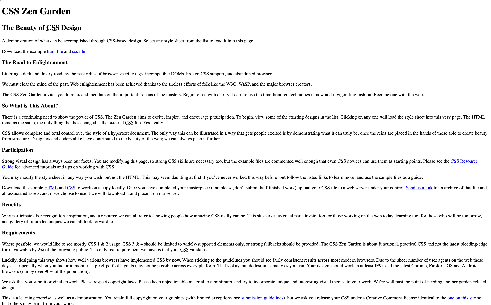
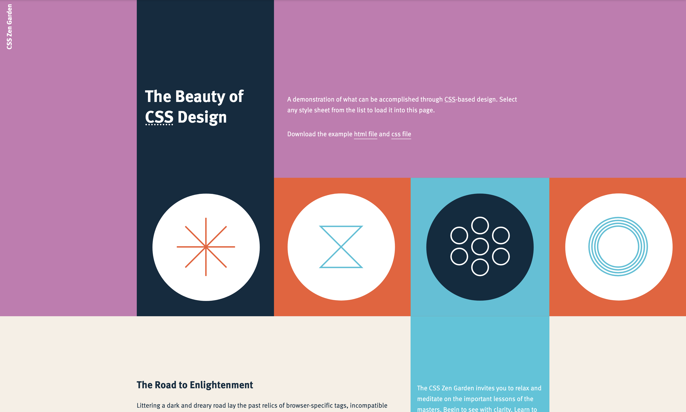

## Introdução

Toda API que serve um modelo de Machine Learning, todo dashboard de dados em tempo real e qualquer interface de IA conversacional dependem de um mesmo pilar invisível: **o protocolo HTTP e a dinâmica cliente-servidor.**

Na **Part 0** do [**Fullstack Open**](https://fullstackopen.com/ptbr/), o objetivo é dissecar essa infraestrutura web sob a ótica de arquitetura: *o que realmente acontece entre o clique do usuário, a transmissão do payload e a renderização do resultado?*

Abaixo, listo as anotações e reflexões sobre requisições web, manipulação do DOM e a transição do modelo tradicional para Single Page Applications (SPAs) — a engrenagem essencial para transformar modelos em produtos de dados reais.

## Conceitos Principais

### 1. HTTP e Comunicação Cliente-Servidor

```{mermaid}
graph LR
    subgraph WebDocument [Web document]
        direction TB
        doc[Estrutura e Estilos]
        img[image]
        vid[Video]
        adv[Advertisement]
    end

    doc -- "GET index.html<br>GET styles.css" --> web[Web server]
    img -- "GET header.png" --> web
    vid -- "GET video.mp4" --> video_server[Video server]
    adv -- "GET advert.jpg" --> ad_server[Ad server]

    style web fill:#aec1cf,stroke:#333,stroke-width:1px
    style video_server fill:#c9c2d9,stroke:#333,stroke-width:1px
    style ad_server fill:#a9def1,stroke:#333,stroke-width:1px
    style img fill:#fdedcc,stroke:#e5b850,stroke-width:1px
    style vid fill:#f7cece,stroke:#c75959,stroke-width:1px
    style adv fill:#fbe6c4,stroke:#dda84d,stroke-width:1px
```

A base de todo o desenvolvimento web — e o ponto de partida essencial para o **Fullstack Open** — apoia-se no modelo **cliente-servidor**. Compreender esse fluxo não é apenas memorizar comandos, mas entender como dados trafegam através da rede para alimentar desde simples páginas estáticas até arquiteturas complexas de microsserviços e APIs de Inteligência Artificial.

#### O Ciclo de Requisição e Resposta (Request/Response)
A comunicação na web é estritamente orientada a mensagens. O navegador (cliente) inicia a conversa enviando uma **requisição HTTP** para um servidor. O servidor processa essa solicitação e devolve uma **resposta HTTP**. 

Esse ciclo assíncrono é a engrenagem por trás de qualquer aplicação moderna: quando uma aplicação web em React precisa buscar uma lista de dados ou enviar um prompt para um modelo de linguagem, ela dispara uma requisição HTTP em segundo plano e aguarda o retorno do servidor sem interromper a experiência do usuário.

#### A Anatomia de uma Requisição HTTP
Para avançar com confiança na construção de APIs com Node.js e Express nos próximos módulos, é fundamental dominar três componentes de uma requisição:

1. **Verbos HTTP (Métodos):** Definem a intenção do cliente sobre um recurso.
   - **`GET`:** Solicita dados ao servidor sem provocar alterações de estado (ex: listar registros ou buscar o resultado de um modelo).
   - **`POST`:** Envia novos dados no corpo da requisição para criar um recurso ou iniciar um processamento (ex: enviar um formulário ou um payload JSON com dados para treino/inferência).
   - **`PUT` / `PATCH`:** Atualizam dados existentes no backend, seja substituindo o recurso por inteiro (`PUT`) ou modificando campos específicos (`PATCH`).
   - **`DELETE`:** Solicita a remoção de um recurso específico no servidor.

2. **Headers (Cabeçalhos):** Funcionam como o "envelope" da requisição, carregando metadados cruciais.
   - `Content-Type: application/json` indica ao backend em qual formato a informação está sendo enviada.
   - `Authorization: Bearer <token>` transporta credenciais de segurança para validar se o cliente tem permissão de acesso.

3. **Corpo da Requisição (Body):** Onde trafegam os dados principais nas requisições `POST`, `PUT` ou `PATCH`, geralmente estruturados em formato **JSON** (JavaScript Object Notation).


#### A Resposta e os Status Codes
Ao receber a requisição, o servidor responde com os dados solicitados e um **Status Code**, um código numérico de três dígitos que sintetiza o resultado da operação:

- **2xx (Sucesso):** Indica que a operação foi concluída como esperado (ex: `200 OK` para consultas bem-sucedidas ou `201 Created` quando um novo recurso é criado no banco).
- **3xx (Redirecionamento):** O recurso solicitado mudou de endereço e o cliente deve ser redirecionado.
- **4xx (Erros do Cliente):** Problemas na requisição enviada pelo cliente (ex: `400 Bad Request` para dados inválidos, `401 Unauthorized` para falta de autenticação, e `404 Not Found` quando a rota não existe).
- **5xx (Erros do Servidor):** Falhas internas no backend (ex: `500 Internal Server Error` quando o código do servidor falha ou perde a conexão com o banco de dados).

Dominar esse contrato de comunicação é o alicerce para construir e integrar sistemas fullstack escaláveis, garantindo que o frontend e o backend conversem em perfeito alinhamento.

### 2. HTML, CSS e JavaScript no Navegador

Para que uma página web ganhe vida, o navegador atua como um maestro orquestrando três linguagens fundamentais:

- **HTML (A Estrutura):** Define o esqueleto e o significado do conteúdo (títulos, parágrafos, botões e formulários).
  
  

- **CSS (O Estilo):** Aplica a camada visual — cores, fontes, alinhamentos e responsividade — tornando a interface atraente e intuitiva.
  
  

- **JavaScript (O Comportamento):** É o cérebro dinâmico. Permite reagir às ações do usuário, validar dados no próprio cliente e fazer requisições assíncronas ao servidor sem recarregar a página.
  
```{=html}
<div id="js-demo-card" style="border: 1px solid #e2e8f0; border-radius: 10px; padding: 1.2rem; background: #f8fafc; margin: 1.5rem 0; box-shadow: 0 2px 4px rgba(0,0,0,0.05);">
  <h5 style="margin-top: 0; color: #1e293b; font-weight: 600;">⚡ Mini-Demo Interativa: JavaScript em Ação</h5>
  <p style="font-size: 0.92rem; color: #475569; margin-bottom: 1rem;">
    Clique no botão abaixo para ver o JavaScript alterando o estado e manipulando o DOM em tempo real, sem recarregar a página:
  </p>
  <div style="display: flex; align-items: center; gap: 12px; flex-wrap: wrap;">
    <button id="demo-btn" onclick="triggerJsDemo()" style="background-color: #2563eb; color: white; border: none; padding: 8px 18px; border-radius: 6px; cursor: pointer; font-weight: 600; font-size: 0.9rem; transition: all 0.2s ease;">
      Executar JS 🚀
    </button>
    <span id="demo-counter" style="font-weight: 600; color: #334155; font-size: 0.9rem;">Interações: 0</span>
  </div>
  <div id="demo-output" style="margin-top: 1rem; padding: 10px 14px; border-radius: 6px; background: #ffffff; border-left: 4px solid #2563eb; font-size: 0.88rem; color: #1e293b; display: none;">
    <strong>Histórico de Eventos (DOM alterado via JS):</strong>
    <ul id="demo-log-list" style="margin: 0.5rem 0 0 0; padding-left: 1.2rem; max-height: 150px; overflow-y: auto;"></ul>
  </div>
</div>

<script>
let interactions = 0;
function triggerJsDemo() {
  interactions++;
  const btn = document.getElementById('demo-btn');
  const counter = document.getElementById('demo-counter');
  const output = document.getElementById('demo-output');
  const logList = document.getElementById('demo-log-list');
  
  counter.textContent = `Interações: ${interactions}`;
  output.style.display = 'block';
  
  // Cria dinamicamente um novo elemento de lista (li) no DOM
  const newLogItem = document.createElement('li');
  newLogItem.style.marginBottom = '4px';
  newLogItem.innerHTML = `Clique #${interactions} registrado às <code>${new Date().toLocaleTimeString()}</code>`;
  
  // Adiciona o novo item no início da lista
  logList.insertBefore(newLogItem, logList.firstChild);
  
  // Altera a cor do botão dinamicamente
  const colors = ['#2563eb', '#059669', '#d97706', '#7c3aed', '#db2777'];
  btn.style.backgroundColor = colors[interactions % colors.length];
}
</script>
```

#### O Fluxo de Carregamento e Execução

Quando você digita uma URL no navegador, uma sequência precisa de passos acontece em milissegundos:

1. **Download do HTML:** O navegador baixa o documento principal e começa a interpretar sua estrutura linha por linha (*parsing*).
2. **Descoberta de Recursos:** Ao encontrar tags como `<link rel="stylesheet">` ou `<script>`, o browser dispara novas requisições HTTP para buscar os arquivos CSS e JS.
3. **Renderização:** O CSS é aplicado sobre a estrutura do HTML para desenhar os pixels na tela (*paint*).
4. **Execução do JS:** O motor JavaScript do navegador (como o V8 no Chrome) executa o código, podendo manipular a tela em tempo real ou escutar eventos do usuário.

Compreender que o JavaScript roda **diretamente no ambiente do cliente (browser)** é o ponto de virada para entender o modelo de desenvolvimento web moderno antes de avançarmos para o ecossistema React.

### 3. Document Object Model (DOM) e Eventos

Se o código HTML é a **planta baixa de uma casa**, o **DOM (Document Object Model)** é a **casa construída na memória do navegador**. 

Quando o browser lê o código HTML estático, ele constrói uma representação orientada a objetos composta por "nós" em formato de **árvore**. O JavaScript não lê o arquivo HTML diretamente; ele interage com essa árvore viva do DOM.

```{mermaid}
graph TD
    doc["document"] --> html["html"]
    html --> head["head"]
    html --> body["body"]
    head --> title["title: Meu Post"]
    body --> h1["h1: Título Principal"]
    body --> p["p: Parágrafo com texto"]
    body --> btn["button: Clique aqui"]
    
    style doc fill:#e2e8f0,stroke:#334155,stroke-width:1px
    style html fill:#cbd5e1,stroke:#334155,stroke-width:1px
    style body fill:#bae6fd,stroke:#0284c7,stroke-width:1px
    style head fill:#fef08a,stroke:#ca8a04,stroke-width:1px
    style btn fill:#bbf7d0,stroke:#16a34a,stroke-width:1px
```

::: {.callout-tip}
## 💡 Conexão de Conceitos: Árvore do DOM vs. Sistema de Arquivos do Linux
Se você já usou o terminal Linux, essa estrutura parecerá extremamente familiar:
- O **`document`** equivale ao **`/`** (diretório raiz ou *root*).
- As tags container (como `<html>`, `<body>` ou `<div>`) funcionam como **pastas e subpastas**.
- Os elementos finais (como `<button>` ou texto) funcionam como **arquivos**.
- Um seletor CSS como `body > div#app > button` funciona exatamente como um caminho de arquivo absoluto (`/home/usuario/app`)!

Ambos são exemplos clássicos de **Estruturas de Dados em Árvore Hieárquica (N-ary Tree)**.
:::

#### As Três Operações Fundamentais do DOM

Toda manipulação interativa no frontend resume-se a três passos:

1. **Selecionar (Querying):** Localizar o elemento desejado na árvore.
   ```javascript
   const botao = document.querySelector('#meu-botao');
   ```
2. **Escutar Eventos (Event Listeners):** Reagir a interações do usuário (cliques, digitação, movimento do mouse, envio de formulários).
   ```javascript
   botao.addEventListener('click', (event) => { ... });
   ```
3. **Modificar (Mutating):** Alterar o texto, classes CSS, estilos ou adicionar/remover novos nós HTML.
   ```javascript
   element.textContent = "Novo texto!";
   element.classList.toggle("destaque");
   ```

---

#### 🧪 Playground do DOM: Adicionando Itens em Tempo Real

Abaixo está um exemplo prático de como o JavaScript escuta o evento de submit de um formulário, previne o comportamento padrão do navegador (`event.preventDefault()`) e insere um novo nó na árvore DOM:

```{=html}
<div style="border: 1px solid #cbd5e1; border-radius: 10px; padding: 1.2rem; background: #ffffff; margin: 1.5rem 0; box-shadow: 0 4px 6px -1px rgba(0,0,0,0.05);">
  <h5 style="margin-top: 0; color: #0f172a; font-weight: 600;">📝 Exemplo Prático: Manipulador de Eventos & DOM</h5>
  
  <form id="dom-todo-form" style="display: flex; gap: 8px; margin-bottom: 1rem;">
    <input type="text" id="dom-todo-input" placeholder="Digite uma tarefa..." required style="flex: 1; padding: 8px 12px; border: 1px solid #94a3b8; border-radius: 6px; font-size: 0.9rem;">
    <button type="submit" style="background-color: #0284c7; color: white; border: none; padding: 8px 16px; border-radius: 6px; font-weight: 600; cursor: pointer;">Adicionar</button>
  </form>

  <ul id="dom-todo-list" style="margin: 0; padding-left: 1.2rem; font-size: 0.9rem; color: #334155;">
    <li>Item inicial carregado no HTML estático</li>
  </ul>
</div>

<script>
document.getElementById('dom-todo-form').addEventListener('submit', function(e) {
  e.preventDefault(); // Impede o recarregamento da página ao enviar o formulário
  
  const input = document.getElementById('dom-todo-input');
  const todoList = document.getElementById('dom-todo-list');
  const itemText = input.value.trim();
  
  if (itemText !== '') {
    // 1. Cria um novo elemento <li> na memória
    const li = document.createElement('li');
    li.textContent = itemText;
    li.style.marginTop = '4px';
    
    // 2. Anexa o novo elemento como filho na lista DOM
    todoList.appendChild(li);
    
    // 3. Limpa o campo de entrada
    input.value = '';
  }
});
</script>
```

Dominar o fluxo **Evento $\rightarrow$ Seleção $\rightarrow$ Manipulação do DOM** no JavaScript puro (Vanilla JS) é o conhecimento fundamental para compreender por que bibliotecas como o **React** foram criadas para abstrair essa complexidade.

### 4. SPA (Single Page Application) vs. Aplicações Tradicionais
[Anotações sobre a diferença entre renderização no servidor (SSR) e no cliente (CSR)]

## Exercícios e Prática

[Espaço para documentar os exercícios realizados na Part 0]

## Conclusão e Aprendizados

[Resumo dos principais pontos aprendidos]
